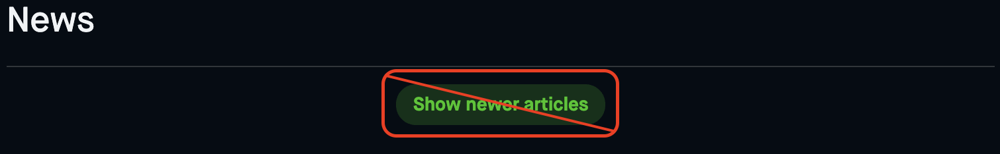

# robinhood-news-refresher
A browser extension for chromium based browsers that gets rid of that annoying "Show newer articles button" on Robinhood by clicking it whenever it shows up.

## Installation
1. Clone this repo to your local machine
2. Open your chromium based browser and navigate to `chrome://extensions/`
3. Ensure that the "Developer mode" toggle is enabled
4. Click on "Load unpacked extension" and select the repo folder
5. Open/refresh the Robinhood website